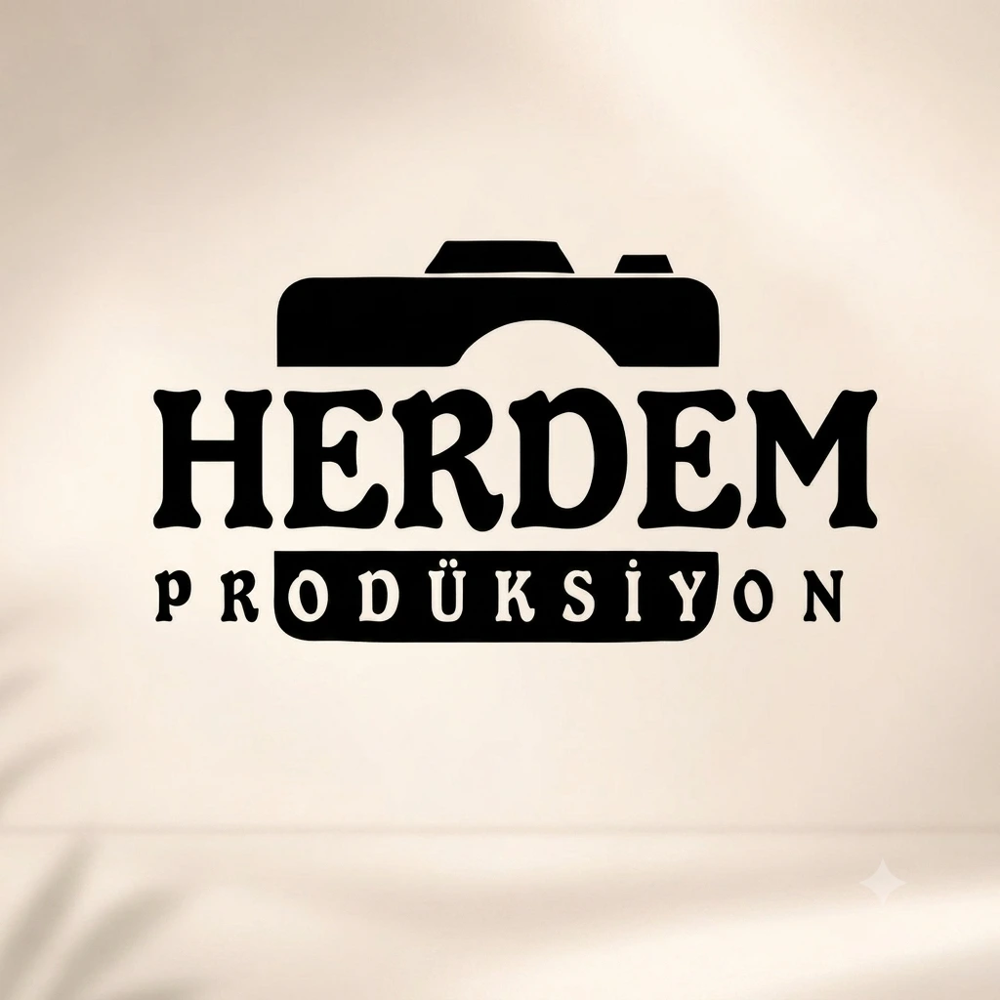

# 📸 Foto Herdem

<p align="center">
  
</p>

<p align="center">
  <strong>Profesyonel fotoğrafçılık sitesi ve müşteri fotoğraf seçim sistemi</strong>
</p>

<p align="center">
  Mardin • Midyat • Düğün • Nişan • Söz • Kına • Dış Çekim
</p>

<p align="center">
  
  
  
  
</p>

---

## ✨ Proje Hakkında

**Foto Herdem**, fotoğrafçılık hizmetlerini modern ve sade bir arayüzle tanıtmak için hazırlanmış web projesidir.

Proje yalnızca klasik bir tanıtım sitesi değildir. Aynı zamanda fotoğrafçı ile müşteri arasındaki **fotoğraf seçme sürecini dijitalleştiren bir müşteri seçim sistemi** içerir.

Müşteri kendisine verilen seçim kodu ve şifre ile özel albümüne giriş yapabilir, fotoğrafları inceleyebilir, belirlenen sayıda fotoğrafı seçebilir ve seçimlerini tek seferde gönderebilir. Yönetici ise bu süreci özel bir admin panelinden yönetebilir. 🎯

## 🚀 Öne Çıkan Özellikler

### 🌐 Ziyaretçi Sitesi

- 🏠 Modern ana sayfa
- 🖼️ Fotoğraf galerisi
- 📚 Albüm koleksiyonu
- 💍 Fotoğrafçılık paketleri
- 📞 İletişim sayfası
- 📱 Mobil uyumlu responsive tasarım
- 🍔 Mobil menü
- 🔎 SEO için title, description, keywords, canonical ve Open Graph etiketleri
- 🌍 Türkçe dil yapısı
- 🖼️ Favicon ve marka görselleri

### 🔐 Müşteri Fotoğraf Seçim Sistemi

Müşterilere özel oluşturulan seçim oturumları sayesinde:

- 🔑 Seçim kodu + şifre ile giriş
- 📸 Albüm fotoğraflarını görüntüleme
- ☑️ Fotoğraf seçme ve seçim sırasını görme
- 🔢 Minimum / maksimum seçim limiti
- 🔍 Büyük fotoğraf görüntüleme (lightbox)
- ⏳ Son kullanma tarihi
- 🚫 İptal edilmiş veya kullanılmış link kontrolü
- 🛡️ Farklı seviyelerde istemci tarafı fotoğraf koruması
- 👤 Müşteri adı ve telefon bilgisi
- 📝 Müşteri notu
- 📤 Seçimleri tek seferde gönderme
- ✅ Başarılı gönderim ekranı

### 🛠️ Admin Paneli

`/admin/` altında bulunan yönetim paneli ile:

- 🔐 Yönetici girişi
- 📚 Albümleri görüntüleme
- 🔗 Müşteri seçim linkleri oluşturma
- 🔑 Müşteri şifresi belirleme
- 🔢 Seçilebilecek fotoğraf sayısını belirleme
- ⏱️ Link süresi belirleme
- 🛡️ Koruma seviyesini belirleme
- 📋 Oluşturulan link ve bilgileri kopyalama
- 👀 Müşteri seçimlerini görüntüleme
- 🚫 Aktif seçim linkini iptal etme
- 🗑️ Seçim oturumunu silme
- 🔐 Admin şifresi değiştirme
- 👥 Ana yönetici tarafından ek admin oluşturma / silme
- 📧 Bildirim e-posta adresini yönetme
- 🧪 Test e-postası gönderme

---

## 🧩 Sistem Nasıl Çalışıyor?

```text
                    ┌──────────────────────┐
                    │      Foto Herdem     │
                    │     Web Sitesi       │
                    └──────────┬───────────┘
                               │
              ┌────────────────┴────────────────┐
              │                                 │
              ▼                                 ▼
      ┌───────────────┐                 ┌────────────────┐
      │ Ziyaretçi     │                 │ Admin Paneli   │
      │ Sayfaları     │                 │ /admin/        │
      └───────────────┘                 └───────┬────────┘
                                                │
                                                ▼
                                      ┌──────────────────┐
                                      │     Supabase     │
                                      │ DB + RPC         │
                                      └────────┬─────────┘
                                               │
                                               ▼
                                      ┌──────────────────┐
                                      │ Müşteri Seçim    │
                                      │ /secim.html      │
                                      └────────┬─────────┘
                                               │
                                               ▼
                                      📸 Fotoğraf Seçimi
                                               │
                                               ▼
                                      📤 Seçimleri Gönder
```

---

## 📁 Proje Yapısı

```text
Foto-Herdem/
│
├── 📁 .github/
│   └── 📁 workflows/
│       └── 📄 build-albums.yml
│
├── 📁 Albümler/
│   ├── 📄 albums.json
│   └── 📁 fotoğraflar/
│       ├── 📁 örnek-düğün-2026/
│       └── 📁 örnek-nişan-2026/
│
├── 📁 admin/
│   ├── 📄 index.html
│   ├── 📄 admin.html
│   ├── 📄 admin.js
│   └── 📄 admin.css
│
├── 📁 assets/
│   ├── 🖼️ logo.webp
│   ├── 🖼️ album-*.webp
│   ├── 🖼️ dis-cekim-*.webp
│   └── 📁 favicon/
│       ├── 📄 favicon.ico
│       ├── 🖼️ apple-touch-icon.png
│       ├── 🖼️ android-icon-*.png
│       ├── 🖼️ apple-icon-*.png
│       ├── 🖼️ favicon-*.png
│       └── 🖼️ ms-icon-*.png
│
├── 📁 css/
│   ├── 📄 style.css
│   ├── 📄 secim.css
│   └── 📄 404.css
│
├── 📁 js/
│   ├── 📄 config.js
│   ├── 📄 main.js
│   ├── 📄 secim.js
│   ├── 📄 analytics.js
│   ├── 📄 cookie-consent.js
│   └── 📁 vendor/
│       └── 📄 supabase.min.js
│
├── 📁 sayfalar/
│   ├── 📄 albumler.html
│   ├── 📄 cerex-politikasi.html
│   ├── 📄 galeri.html
│   ├── 📄 iletisim.html
│   └── 📄 paketler.html
│
├── 📁 scripts/
│   └── 📄 build-albums.js
│
├── 📁 supabase/
│   └── 📄 schema.sql
│
├── 📄 index.html
├── 📄 404.html
├── 📄 secim.html
├── 📄 browserconfig.xml
├── 📄 manifest.json
├── 📄 robots.txt
├── 📄 sitemap.xml
└── 📄 LICENSE
```

---

## 🗂️ Albüm Sistemi

Fotoğraflar doğrudan `Albümler/fotoğraflar/` klasörü altında albümlere ayrılır.

Örneğin:

```text
Albümler/
└── fotoğraflar/
    ├── örnek-nişan-2026/
    │   ├── fotoğraf dosyaları buraya
    │   └── ...
    │
    └── örnek-düğün-2026/
        ├── fotoğraf dosyaları buraya
        └── ...
```

Yeni albüm eklendikten sonra manifest dosyası şu komutla yeniden oluşturulur:

```bash
node scripts/build-albums.js
```

Bu komut:

- 📂 Albüm klasörlerini tarar
- 🖼️ Desteklenen görselleri bulur
- 🔤 Albüm ID'si oluşturur
- 🏷️ Albüm başlığını oluşturur
- 🖼️ Kapak fotoğrafını belirler
- 🔢 Fotoğraf sayısını hesaplar
- 📄 `Albümler/albums.json` dosyasını günceller

### Desteklenen görsel formatları

```text
.jpg
.jpeg
.png
.webp
.gif
.heic
.avif
```

---

## 🔐 Supabase Yapısı

Projenin yönetim ve müşteri seçim sistemi **Supabase** üzerinde çalışır.

`supabase/schema.sql` dosyası gerekli veritabanı yapısını oluşturur.

Temel tablolar:

| Tablo | Görevi |
|---|---|
| `admins` | Yönetici hesapları |
| `admin_sessions` | Admin oturumları |
| `customer_sessions` | Müşteri seçim oturumları |
| `selections` | Gönderilen fotoğraf seçimleri |
| `albums` | Albüm meta verileri |
| `admin_settings` | Yönetim ayarları |

Ayrıca veritabanı işlemlerinin önemli bölümü güvenli RPC fonksiyonları üzerinden gerçekleştirilir.

---

## ⚙️ Kurulum

### 1️⃣ Projeyi klonla

```bash
git clone <repo-url>
cd Foto-Herdem
```

### 2️⃣ Supabase projesi oluştur

Supabase üzerinde yeni bir proje oluşturun.

Ardından:

```text
Supabase Dashboard
        ↓
SQL Editor
        ↓
supabase/schema.sql
        ↓
Run
```

`schema.sql` dosyasını çalıştırarak gerekli tabloları ve fonksiyonları oluşturun.

### 3️⃣ Supabase bağlantısını tanımla

`js/config.js` içerisinde:

```javascript
window.FH_CONFIG = {
  SUPABASE_URL: "YOUR_SUPABASE_URL",
  SUPABASE_ANON_KEY: "YOUR_SUPABASE_ANON_KEY"
};
```

> ⚠️ Gerçek proje bilgilerini GitHub'a koyarken güvenlik ve erişim politikalarınızı kontrol edin. Supabase `anon/publishable` anahtarının tek başına admin yetkisi vermemesi gerekir; asıl güvenlik veritabanı politikaları ve RPC fonksiyonları tarafından sağlanmalıdır.

### 4️⃣ Albüm manifestini oluştur

```bash
node scripts/build-albums.js
```

### 5️⃣ Yerel olarak çalıştır

Proje statik HTML/CSS/JS yapısında olduğu için herhangi bir basit HTTP sunucusu kullanılabilir.

Örneğin:

```bash
npx serve .
```

veya VS Code üzerinde **Live Server** kullanılabilir.

---

## 🔗 Sayfalar

| Sayfa | Açıklama |
|---|---|
| `/` | 🏠 Ana sayfa |
| `/sayfalar/galeri.html` | 🖼️ Fotoğraf galerisi |
| `/sayfalar/albumler.html` | 📚 Albümler |
| `/sayfalar/paketler.html` | 💍 Paketler |
| `/sayfalar/iletisim.html` | 📞 İletişim |
| `/secim.html` | 🔐 Müşteri fotoğraf seçimi |
| `/admin/` | 🛠️ Yönetim paneli |

---

## 🛡️ Güvenlik

Proje içerisinde müşteriye özel seçim oturumları için:

- 🔑 Kod + şifre doğrulaması
- ⏳ Süre kontrolü
- 🚫 Kullanılmış link kontrolü
- 🚫 İptal edilmiş link kontrolü
- 🔐 Admin oturum token'ları
- 🧱 Supabase Row Level Security (RLS)
- ⚙️ Security Definer RPC fonksiyonları
- 🕵️ Admin sayfalarında `noindex,nofollow`
- 🖱️ Fotoğraf koruma seviyeleri

kullanılmaktadır.

### ⚠️ Önemli

Tarayıcı tarafındaki fotoğraf koruması **mutlak bir indirme engelleme sistemi değildir**. Web tarayıcısına gönderilen bir görsel, teknik olarak ekran görüntüsü veya başka yöntemlerle kopyalanabilir.

Bu nedenle yüksek çözünürlüklü orijinal fotoğrafların herkese açık URL'lerde tutulması yerine, üretim ortamında uygun depolama erişim politikaları ve mümkünse thumbnail / düşük çözünürlük önizleme yaklaşımı değerlendirilmelidir.

Ayrıca üretim ortamına geçmeden önce:

- Varsayılan admin şifresi değiştirilmelidir.
- Supabase RLS politikaları test edilmelidir.
- Gereksiz public erişimler kapatılmalıdır.
- Hassas verilerin istemci tarafına gönderilmediğinden emin olunmalıdır.
- E-posta / form entegrasyonlarının production ayarları kontrol edilmelidir.

---

## 🎨 Tasarım

Foto Herdem'in tasarım dili fotoğrafçılık sektörüne uygun şekilde:

- 🤎 Sıcak kahverengi / toprak tonları
- 🤍 Açık ve ferah arka planlar
- ✨ Minimal tipografi
- 🖼️ Fotoğrafı öne çıkaran kart yapıları
- 📱 Mobil öncelikli responsive yaklaşım
- 🎯 Sade ve anlaşılır CTA butonları

üzerine kurulmuştur.

Ana marka rengi CSS tarafında `--brand-*` değişkenleri üzerinden yönetilebilir.

---

## 📱 Responsive Tasarım

Site masaüstü ve mobil cihazlar için uyarlanmıştır.

Mobil cihazlarda:

- 🍔 Hamburger menü
- 📐 Responsive grid yapıları
- 👆 Dokunmatik kullanım
- 🖼️ Mobil uyumlu galeri
- 🔐 Mobil fotoğraf seçim ekranı

kullanılır.

---

## 🔄 Müşteri Seçim Akışı

### 👨‍💼 Fotoğrafçı

```text
Admin Paneli
    ↓
Albüm seç
    ↓
Müşteri şifresi belirle
    ↓
Minimum / maksimum fotoğraf sayısı
    ↓
Süre belirle
    ↓
Koruma seviyesi seç
    ↓
Seçim linkini oluştur
```

### 👰🤵 Müşteri

```text
Seçim linki
    ↓
Kod + şifre
    ↓
Albüm
    ↓
Fotoğrafları incele
    ↓
Fotoğrafları seç
    ↓
İsim + telefon + not
    ↓
Seçimleri gönder
    ↓
✅ Tamamlandı
```

### 📊 Fotoğrafçı

```text
Admin Paneli
    ↓
Oturumlar
    ↓
Seçimleri görüntüle
    ↓
Müşterinin seçtiği fotoğrafları gör
    ↓
Düzenleme / baskı sürecine devam et
```

---

## 🧰 Kullanılan Teknolojiler

| Teknoloji | Kullanım |
|---|---|
| HTML5 | Sayfa yapısı |
| CSS3 | Tasarım ve responsive yapı |
| JavaScript | Etkileşim ve uygulama mantığı |
| Supabase | Veritabanı, RPC ve oturum altyapısı |
| PostgreSQL | Supabase veritabanı |
| Node.js | Albüm manifest oluşturma scripti |
| Open Graph | Sosyal medya önizlemeleri |
| SEO Meta Tags | Arama motoru optimizasyonu |

---

## 📌 Geliştirme Fikirleri

Proje gelecekte şu özelliklerle daha da geliştirilebilir:

- [ ] ☁️ Supabase Storage ile tam bulut albüm yönetimi
- [ ] 🖼️ Otomatik thumbnail oluşturma
- [ ] 📥 Admin panelinden fotoğraf yükleme
- [ ] 🗑️ Admin panelinden albüm / fotoğraf yönetimi
- [ ] 📊 Daha gelişmiş seçim istatistikleri
- [ ] 📧 Profesyonel e-posta bildirim sistemi
- [ ] 📱 WhatsApp paylaşım butonu
- [ ] 📄 Müşteri seçimlerini PDF / CSV olarak dışa aktarma
- [ ] 🌙 Dark mode
- [ ] 👥 Daha gelişmiş kullanıcı rolleri
- [ ] 🔒 Signed URL / private storage tabanlı fotoğraf erişimi
- [ ] ⚡ Görsel optimizasyonu ve lazy loading geliştirmeleri
- [ ] 🌐 Özel domain ve production CDN yapılandırması

---


---

<p align="center">
  <strong>📸 Foto Herdem</strong><br>
  <sub>Anıları geleceğe taşıyoruz.</sub>
</p>

---

## 📄 Lisans

Bu proje **tüm hakları saklı** lisansı altındadır.

```
Copyright (c) 2026 Muhammed Akay
Tüm hakları saklıdır. İzin olmadan kopyalanamaz, dağıtılamaz veya ticari amaçla kullanılamaz.
Tasarım ve Geliştirme: Muhammed Akay
```

Detaylar için [LICENSE](LICENSE) dosyasına bakınız.
